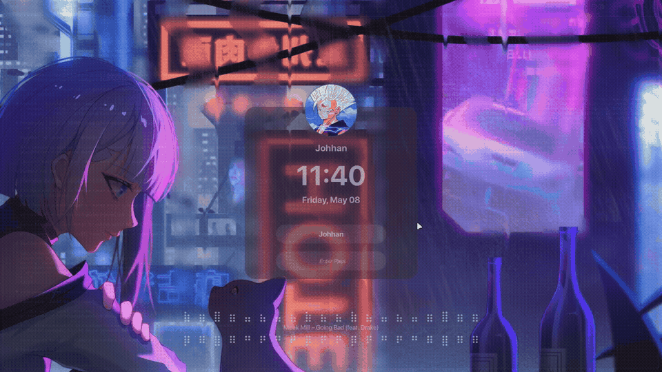

<div align="center">

# Arch Linux Dotfiles


Personal configuration files for **Arch Linux** + **Hyprland** + **HyDE**.




</div>

---

## Setup

| Component | Tool |
|-----------|------|
| OS | Arch Linux |
| WM | Hyprland |
| Framework | HyDE |
| Screen locker | Hyprlock |
| Visualizer | Cava |
| Shell | Zsh |

---

## What's included

- **Hyprlock** — lock screen layout with profile photo, clock, and music widget
- **Cava equalizer** — animated audio visualizer above and below the song title
- **Scripts** — `eq.sh`, `eq_inverted.sh`, `nowplaying.sh`, `cava_to_file.sh`
- **Cava config** — tuned with monstercat smoothing for a wave-like look
- **userprefs** — Hyprland user preferences including autostart for cava

---

## Install

### Dependencies

```bash
sudo pacman -S hyprland hyprlock cava stow playerctl
```

### Clone and apply

```bash
git clone https://github.com/MagicExist/archlinux-dotfiles ~/dotfiles
cd ~/dotfiles
stow --no-folding .
```

> Make sure **HyDE** is already installed before applying these dotfiles.
> Check [HyDE](https://github.com/HyDE-Project/HyDE) for installation instructions.

---

## Music widget

The lock screen shows a live audio equalizer using [cava](https://github.com/karlstav/cava) and [playerctl](https://github.com/altdesktop/playerctl). It only activates when music is playing. Cava runs in the background on login via `exec-once` in `userprefs.conf`.
